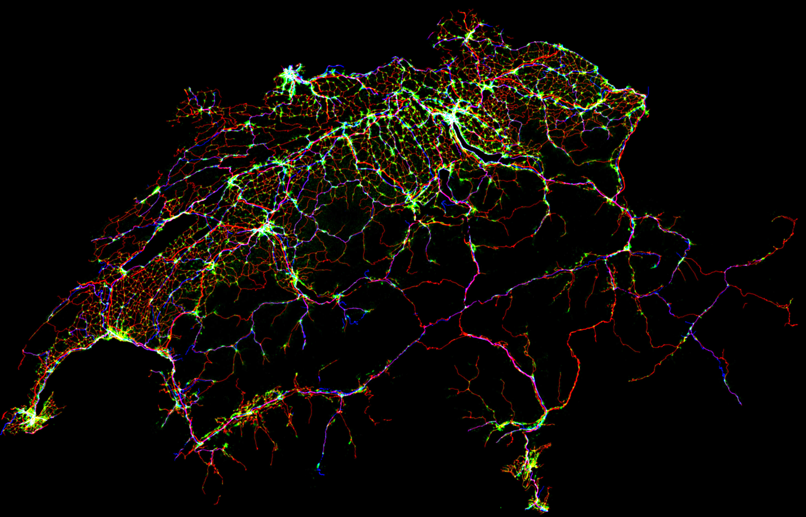

# OpenStreetMap to GeoTIFF for Switzerland

In this small project, we leverage open data to extract feature maps for Switzerland. We rely on [OpenStreetMap](https://www.openstreetmap.org/) data to extract topographical features at a 100x100 meters resolution. This includes building footprints, roads, railways, water bodies, and forests. The output is stored as GeoTIFF, each feature as a separate channel, using [LV95](https://epsg.io/2056) as coordinate system (c.f. [Swiss coordinate system](https://en.wikipedia.org/wiki/Swiss_coordinate_system)).

<p align="center" width="90%">
  
  <br>
  <em>Roads (in red), buildings (in green), and railways (in blue) of Switzerland. The image is post-processed for better visualization, see <a href="./notebooks/extract_png.ipynb"><code>./notebooks/extract_png.ipynb</code></a>. Please refer to the <a href="#releases">Releases</a> section regarding the license.</em>
</p>


## Getting started

If you use Conda, an [`environment.yml`](environment.yml) is provided:

```
conda env create --file environment.yml
```

Alternatively, you can install [`requirements.txt`](requirements.txt) using Pip. The [Cairo](https://www.cairographics.org/) library must be installed separately, typically using a package manager; here is an example on Ubuntu:

```
sudo apt-get install libcairo2
pip install -r requirements.txt
```

In order to download an extract of OpenStreetMap data for Switzerland, we rely on [Geofabrik GmbH](https://download.geofabrik.de/europe/switzerland.html) dumps, which are updated daily. To proceed, download [`switzerland-latest-free.shp.zip`](https://download.geofabrik.de/europe/switzerland-latest-free.shp.zip) to `./data/`:

```
curl -o ./data/switzerland-latest-free.shp.zip https://download.geofabrik.de/europe/switzerland-latest-free.shp.zip
```

The recommended way to process this input file is to open and run [`./notebooks/generate_geotiff.ipynb`](./notebooks/generate_geotiff.ipynb) using Jupyter, which provides an interactive session:

```
jupyter notebook
```

Alternatively, you can use [papermill](https://papermill.readthedocs.io/) to run it from the terminal:

```
papermill --cwd ./notebooks/ ./notebooks/generate_geotiff.ipynb ./notebooks/generate_geotiff.out.ipynb
```


## Releases

While Geofabrik uploads dumps daily, we process a new version every 6 months, as the output is unlikely to change significantly. The provided [`switzerland.tif`](https://github.com/sdsc-innovation/osm-geotiff/releases/latest) is released under the [Open Data Commons Open Database License (ODbL)](https://opendatacommons.org/licenses/odbl/), as per [OpenStreetMap guidelines](https://osmfoundation.org/wiki/Licence/Attribution_Guidelines).

The code used to process the data is released under the [MIT license](./LICENSE).
